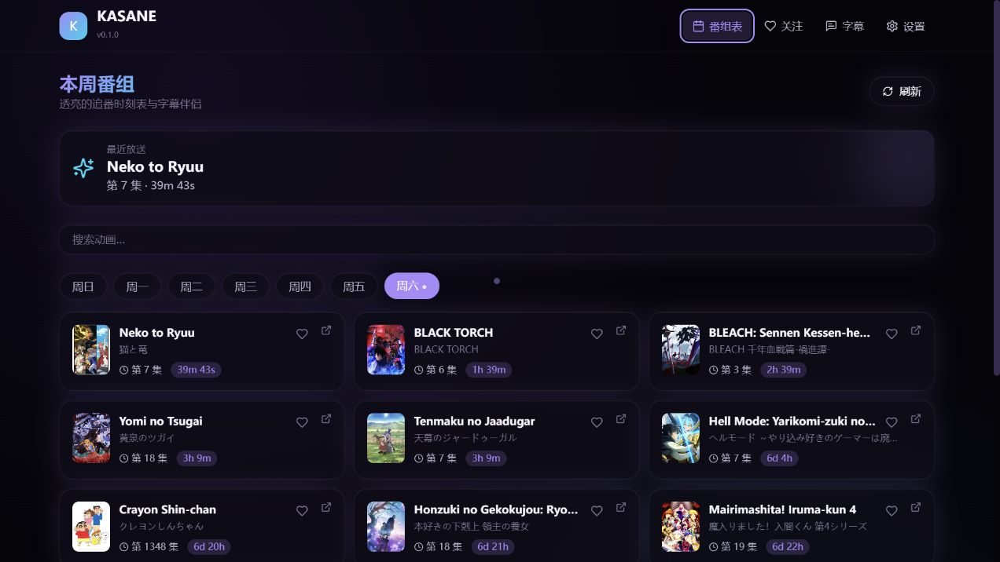

# KASANE Desktop

> 透亮的追番时刻表与字幕伴侣 / A translucent anime schedule and subtitle companion

KASANE 是一款使用 **Tauri 2 + React 18 + TypeScript + Tailwind CSS** 构建的开源桌面应用，主打玻璃质感、轨道式界面、月紫与青色双色调，提供本周番组表、关注订阅、双向按钮手势、HALO 轨道菜单与字幕浮层。整个前端同样可以在普通浏览器中以开发模式运行（`pnpm dev:browser`），方便在没有 Tauri 工具链的机器上做视觉与功能验证。

KASANE is an open-source desktop companion built with **Tauri 2 + React 18 + TypeScript**. It focuses on a translucent glass aesthetic with moon-purple and cyan accents, a weekly AniList-powered schedule, subscriptions, a dual-button gesture state machine, a HALO radial menu, and a transparent subtitle overlay. The frontend also runs as a normal browser SPA (`pnpm dev:browser`) so design and behavior can be verified without the Tauri toolchain.



---

## English Quick Summary

- **Stack:** Tauri 2 + React 18 + TypeScript + Vite 5, Vitest, ESLint 9.
- **License:** MPL-2.0 (see `LICENSE`).
- **Platforms targeted:** Windows 10+ and macOS 12+. macOS hardware validation has **not** been performed in this release.
- **Persistence:** Browser / Tauri `localStorage` only — no telemetry, no accounts.
- **Schedule source:** AniList public GraphQL (`https://graphql.anilist.co`, no auth). When the network or API fails, a bundled fictional fallback dataset is shown and clearly labeled.
- **HALO menu:** Custom six-direction radial menu opened with `Ctrl+Space` / `Cmd+Space`, plus an in-app mouse gesture demo. OS-global mouse hooks are **experimental and not implemented** in v0.1.0.
- **Subtitle overlay:** Transparent, always-on-top Tauri window driven by a safe adapter. v0.1.0 ships a **manual input demo only**; system audio capture and native ASR are roadmap items, not implemented.
- **Localization:** Simplified Chinese (primary), Japanese, English.

For full architectural details, see [`docs/ARCHITECTURE.md`](docs/ARCHITECTURE.md).

---

## 特性与状态（Feature Status）

> 本表区分：✅ 已实现 · 🧪 实验 / Demo · 🛣 路线图 / Roadmap。下文所有声明都以此表为准。

| 区域 | 能力 | 状态 | 说明 |
|------|------|------|------|
| 排程 | AniList GraphQL 拉取（无需鉴权） | ✅ | `src/lib/anilist.ts`，无任何 token。 |
| 排程 | 离线 / API 失败时的演示数据集 | ✅ | `src/lib/fallback.ts`，所有标题均为虚构并打上 `DEMO` 角标。 |
| 排程 | 周历导航、下一话倒计时、搜索过滤 | ✅ | `src/hooks/useSchedule.ts` + `src/lib/schedule.ts`。 |
| 关注 | 关注 / 取消关注、持久化（localStorage） | ✅ | `src/hooks/useSubscriptions.ts`，封装在仓储层。 |
| 视图 | 紧凑卡片 + 仪表盘切换 | ✅ | `src/components/CompactView.tsx`、`DashboardView.tsx`。 |
| 设置 | 语言 / 主题 / 减少动画 / 视图模式 | ✅ | `src/components/SettingsPanel.tsx`。 |
| 国际化 | 简体中文 / 日语 / 英语 主 UI 字符串 | ✅ | `src/i18n/index.ts`。 |
| HALO 菜单 | 轨道式六向菜单 + 键盘可访问 | ✅ | `src/components/HaloMenu.tsx`，`Ctrl+Space` / `Cmd+Space` 打开。 |
| HALO 菜单 | 双键向下手势状态机（含单元测试） | ✅ | `src/lib/gesture.ts` + `src/lib/gesture.test.ts`。 |
| HALO 菜单 | 应用内鼠标手势演示 | ✅ | `src/components/GestureDemo.tsx`。 |
| 字幕 | 半透明、置顶、不可聚焦穿透的 Tauri 字幕窗 | ✅ | `src-tauri/src/main.rs` + `src/lib/tauri.ts`。 |
| 字幕 | 手动日文输入 + 暂定 / 确定 双状态 | ✅ | `src/routes/Overlay.tsx` + `src/components/SubtitleOverlay.tsx`。 |
| 字幕 | 系统级音频捕获（OS loopback / mic） | 🛣 | v0.1.0 未实现。架构占位在 `src/lib/tauri.ts`，明确标注实验。 |
| 字幕 | 原生 ASR（whisper.cpp / sherpa-onnx 等） | 🛣 | v0.1.0 未实现。无任何权重或二进制随仓库分发。 |
| 全局手势 | OS 全局鼠标钩子（脱离应用触发 HALO） | 🛣 | 当前仅在应用内演示可触发。OS 全局钩子需要平台原生扩展，标记为路线图。 |
| Tauri | 主窗口 + 字幕叠层窗口 | ✅ | `src-tauri/tauri.conf.json` 定义主窗；`create_overlay_window` 动态创建叠层。 |
| CI | Windows / macOS / Ubuntu 前端检查 | ✅ | `.github/workflows/ci.yml`。 |
| Release | 标签触发 Windows / macOS Tauri 构件 | ✅ | `.github/workflows/release.yml`，使用 `tauri-apps/tauri-action`；构件**未签名**。 |
| macOS 签名 | Apple Developer ID / 公证 | ❌ | v0.1.0 未配置，构件为未签名 / 未公证，仅供自测。 |

> 我们不在 README 中贴假徽章、不冒充完成了 macOS 硬件验证。任何“已通过 macOS 物理机验证”的说法都是不实的。

---

## 快速开始

### 前置依赖

- **Node.js** ≥ 18（CI 使用 20，仓库约定 18+ 即可）
- **pnpm** 9（仓库以 `pnpm@9.14.0` 为目标；其他 9.x 版本亦可）
- **Tauri 2** 系统依赖（仅在需要构建桌面端时）：参考 <https://v2.tauri.app/start/prerequisites/>

> 本仓库的开发流程以 `pnpm` 为唯一包管理器；请不要混用 npm / yarn 重新生成 `pnpm-lock.yaml`。

### 安装与运行

```bash
# 1. 克隆并安装依赖
git clone https://github.com/hositsuki/kasane-desktop.git
cd kasane-desktop
pnpm install

# 2. 仅运行前端（在浏览器中打开 http://localhost:1420）
pnpm dev:browser

# 3. 启动 Tauri 桌面应用（需要 Rust 工具链）
pnpm tauri:dev

# 4. 类型检查 / 测试 / Lint / 构建
pnpm typecheck
pnpm test
pnpm lint
pnpm build
```

### 浏览器 vs 桌面

| 场景 | 推荐命令 |
|------|----------|
| 设计 / 交互验证 | `pnpm dev:browser` |
| 桌面集成验证 | `pnpm tauri:dev` |
| 桌面端生产构件 | `pnpm tauri:build` |
| 仅前端产物 | `pnpm build` |

---

## 项目结构

```
kasane-desktop/
├── .github/
│   └── workflows/
│       ├── ci.yml              # PR / push: lint / typecheck / test / build
│       └── release.yml         # 标签: 打包 Windows / macOS 构件（未签名）
├── docs/
│   └── ARCHITECTURE.md         # 模块 / 数据流 / 状态机说明
├── public/
│   └── kasane-icon.svg         # 原始 SVG 应用图标
├── src/                        # React 前端
│   ├── components/             # 视图、卡片、HALO、字幕、设置
│   ├── hooks/                  # useSchedule / useSubscriptions / useHaloGesture ...
│   ├── i18n/                   # zh-CN / ja / en 文案
│   ├── lib/                    # 纯函数（gesture / schedule / anilist / fallback / tauri adapter / storage）
│   ├── routes/                 # Home + 字幕叠层路由
│   ├── styles/                 # CSS 变量 + 玻璃质感
│   ├── test/                   # vitest 启动文件
│   ├── App.tsx
│   └── main.tsx
├── src-tauri/                  # Tauri 2 Rust 外壳
│   ├── src/main.rs             # 主窗 + 字幕叠层命令
│   ├── tauri.conf.json
│   ├── build.rs
│   └── icons/                  # （占位）Tauri 图标
├── index.html
├── package.json
├── tsconfig.json
├── vite.config.ts
├── eslint.config.js
└── LICENSE                     # MPL-2.0
```

---

## 隐私与遥测

- 仓库无任何后端服务、不收集遥测、不引入账号体系。
- AniList 公开 GraphQL 调用仅用于查询本周番组（`Page` 查询，无 token），调用失败立即回退到内置的虚构演示数据。
- 关注列表、设置、字幕草稿均存于本机（浏览器 `localStorage` 或 Tauri 默认的 app data 目录），不会上传。

---

## 路线图（v0.2+ 候选）

- 系统级音频捕获（Tauri `cpal` 绑定 / WASAPI loopback / macOS `ScreenCaptureKit`）的真实实现。
- 可选本地 ASR 后端（如 `whisper.cpp`、`sherpa-onnx`）；保持模型权重 / 二进制不随仓库分发。
- OS 全局鼠标 / 键盘钩子，让 HALO 菜单在任意应用中触发。
- 桌面端 SQLite 存储，把关注 / 设置从 `localStorage` 迁出。
- i18n 拓展（zh-TW / ko）。

---

## 贡献与社区

- 阅读 [`CONTRIBUTING.md`](CONTRIBUTING.md) 了解开发约定、提交规范与 PR 流程。
- 阅读 [`CODE_OF_CONDUCT.md`](CODE_OF_CONDUCT.md) 了解行为准则。
- 报告安全漏洞请遵循 [`SECURITY.md`](SECURITY.md) 的私密披露流程。
- 第三方依赖与许可证见 [`THIRD_PARTY_NOTICES.md`](THIRD_PARTY_NOTICES.md)。
- 完整变更历史见 [`CHANGELOG.md`](CHANGELOG.md)。

---

## 许可证

本项目使用 [Mozilla Public License 2.0](https://www.mozilla.org/MPL/2.0/)。参见根目录 [`LICENSE`](LICENSE) 文件。第三方组件的许可见 `THIRD_PARTY_NOTICES.md`。
